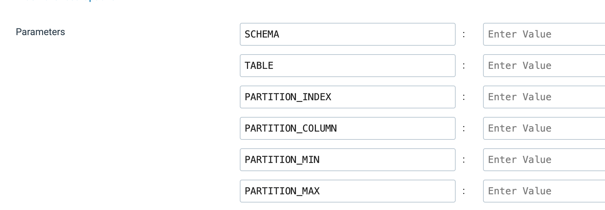

## streamsets-scale-out-table-partition-processing

This project provides an example of how to both scale-up and scale-out JDBC table multithreaded partition processing.

## Overview

Data Collector's [JDBC Multitable Consumer](https://docs.streamsets.com/portal/platform-datacollector/latest/datacollector/UserGuide/Origins/MultiTableJDBCConsumer.html#concept_zp3_wnw_4y) allows one to scale-up table processing by using [multithreaded partition processing](https://docs.streamsets.com/portal/platform-datacollector/latest/datacollector/UserGuide/Origins/MultiTableJDBCConsumer.html#concept_gvy_yws_p1b).  For example, one could configure a Data Collector pipeline to open 10 concurrent JDBC connections to read records, and to process those records using 10 concurrent threads.

However, in some cases, one might want to scale-out the processing for higher throughput, rather than just scaling-up


## Scaling-Up a JDBC Multitable Consumer Pipeline

Consider a pipeline like this that reads from one table and writes to ADLS:


One can specify multiple threads for the pipeline like this:


Assume only one table is specified:


and multithreaded partiton processing is enabled:


The result will be scaled-up processing with up to ten threads processing records from up to ten partitions concurrently. However, this pipeline will only run on a single instance of Data Collector, so it is scaled-up but not scaled-out.


## Scaling-Out a JDBC Multitable Consumer Pipeline

One can scale-out JDBC Multitable Consumer processing using a [Job Template](https://docs.streamsets.com/portal/platform-controlhub/controlhub/UserGuide/JobTemplates/JobTemplates_title.html) to spawn multiple Job Template instances.

Each Job Template Instance will run its own instance of the pipeline, each one working on a different partition, and those instances will be placed across however many Data Collector Engines are available.

Assuming that multiple Data Collectors are deployed, here are the steps to scale out the JDBC processing:

- Step #1: The JDBC Multitable Consumer Pipeline will be parameterized

- Step #2: A Job Template will be created for the parameterized JDBC Multitable Consumer Pipeline

- Step #3: A "helper" Job will use a pipeline to query the min and max values of the JDBC pipeline's source table's offset column, calculate the boundaries for a user-defined number of partitions, and use a [Start Jobs Processor](https://docs.streamsets.com/portal/platform-datacollector/latest/datacollector/UserGuide/Processors/StartJob-P.html#concept_irv_l5r_2jb) to launch multiple instances of the template for the JDBC Multitable Consumer pipeline, passing in the partition values for each instance.


### Step #1: Parameterize your JDBC Multitable Consumer Pipeline

Add these parameters to your JDBC Multitable Consumer Pipeline:



Set the parameters in the JDBC Multitable Consumer's Tables tab as shown.

The schema and table:


The offset columne:


The extra offset column conditions:


### Step #2: Create a Job Template for the JDBC Multitable Consumer Pipeline

Create a Job Template for the JDBC Multitable Consumer pipeline that exposes the pipeline's parametes:


### Step #3: Create a Helper Job

- Import the example Pipeline named <code>Scale-Out Partition Processing</code>


- Set JDBC connection properties for the JDBC Query Origin

- Specify the Control Hub URL and authentication properties for the Start Jobs Processor.

- Create a Job named <code>Scale-Out Partition Processing</code> for the <code>Scale-Out Partition Processing</code> pipeline.

- Specify parameter values for the Scale-Out Partition Processing Job. For example, in my environment I set these parameter values:


- Note that I specified 4 partitions for the table <code>STREAMSETS.T1</code> with the partition column named <code>ID</code>, as well as the Job Template ID for the Job Template created in Step #2 above for the JDBC pipeline.

The JDBC Query Origin has this query:

```
	SELECT 
  		MIN(${PARTITION_COLUMN}) AS "global_min",  
 		MAX(${PARTITION_COLUMN}) AS "global_max"
	FROM ${SCHEMA}.${TABLE}
```

and we can see the values retrieved in my environment in Preview mode:


The <code>Create Partitions</code> stage is a [Jython Evaluator](https://docs.streamsets.com/portal/platform-datacollector/latest/datacollector/UserGuide/Processors/Jython.html#concept_a1h_lkf_lr) that does a little math on the min and max offset values and number of partitions parameter, and emits a list of partitions with <code>PARTITION_MIN</code> and <code>PARTITION_MAX</code> values like this:


The <code>Format Template Parameters</code> stage is a JSON Generator that converts the partition list field to a JSON string in a field named <code>template_params</code>:


The <code>Start Jobs</code> stage is a Start Jobs Processor configured to create and run in the background multiple instances of the specified Job Template, using the list of parameters in the <code>template_params</code> record field. Set the Control Hub URL and credentials for your environment:


## Run the Scale-Out Partition Processing Job

Run the <code>Scale-Out Partition Processing</code> Job and you should see one Job Template Instance started for each partition specified, in my case four:


You can inspect the runtime parameters for each running Job template Instance. For example, instance number two has these runtime parameters:


## Combine Scale-Up with Scale-Out for maximum throughput

To combine scale-up with scale-out processing, use the helper Job described above to launch multiple Job Template Instances of the JDBC pipeline. Configure the JDBC pipeline to use multiple threads and enable multithreaded partition processing.  The result will be multiple instances of the JDBC pipeline running across a pool of Data Collectors (if available), and with each pipeline instance processing its assigned partition using multiple threads, with each thread processing a sub-partitions of the assigned partition concurrently. 
